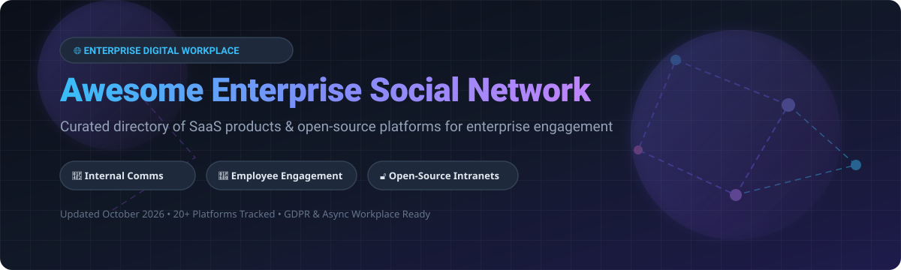

  
  
  
  
  
  

# 🌐 Awesome Enterprise Social Network 🚀

> **A curated, comprehensive directory of Enterprise Social Networks (ESN), Intranets, Internal Communications Platforms & Self-Hosted Open-Source Digital Workplaces.**
> *Optimized for internal comms leaders, HR tech decision-makers, IT administrators, and digital employee experience (DEX) architects.*

---

## 📚 Table of Contents

- [💡 Overview & Market Insights](#-overview--market-insights)
- [☁️ Commercial SaaS Platforms](#️-commercial-saas-platforms)
- [🔓 Open-Source GitHub Repositories](#-open-source-github-repositories)
- [🤝 How to Contribute](#-how-to-contribute)
- [☕ Support & Sponsor](#-support--sponsor)
- [📈 Star History](#-star-history)
- [⚠️ Disclaimer & Compliance](#️-disclaimer--compliance)

---

## 💡 Overview & Market Insights

Enterprise Social Networks (ESNs) and Digital Employee Experience (DEX) platforms connect distributed workforces, streamline executive-to-employee messaging, facilitate cross-departmental knowledge sharing, and foster culture across desk-based and frontline workers.

### 📊 Sector Market Size & Dynamics
> 📈 **Market Valuation & Growth**: The global Enterprise Social Network and Digital Workplace software market is estimated at **$10.2 Billion in 2026** and is projected to expand to **$24.8 Billion by 2032** at a Compound Annual Growth Rate (CAGR) of **15.8%**.
> 
> 🧩 **Market Fragmentation**: The market is **moderately fragmented**, operating as a **multi-vendor ecosystem** rather than a single winner-take-all monopoly. While **Microsoft (Viva Engage)** commands dominant distribution through Microsoft 365 licensing and **Salesforce (Slack)** leads real-time channel communication, enterprise buyers heavily adopt specialized suites like **Staffbase**, **Workvivo by Zoom**, **Simpplr**, and **MangoApps** for dedicated intranet governance and frontline engagement. Furthermore, privacy-first enterprises increasingly deploy self-hosted open-source alternatives like **Mastodon**, **Discourse**, **Rocket.Chat**, and **HumHub**.

---

## ☁️ Commercial SaaS Platforms

Below is a curated comparison of top commercial Enterprise Social Network platforms, sorted by **Company Size (Revenue / Market Valuation) in descending order**:

| Platform | Description | Pricing (Starting Tier) | Free Tier / Trial Limits | Company Size (Revenue / Valuation) 🔽 |
| :--- | :--- | :--- | :--- | :--- |
| 🔹 **[Microsoft Viva Engage](https://www.microsoft.com/en-us/microsoft-viva/engage)** | **Enterprise social network integrated with M365.** Features Communities, Leadership Corner, Storyline feeds, and AI Answers. | **Core included in M365 E1/E3/E5/F3** ($10–$38/user/mo). **Communities Premium**: **$2.00/user/mo**. **Viva Suite**: **$12.00/user/mo**. | **30-day M365 enterprise trial** (up to 25 user licenses with full Viva Engage access). | **~$281 Billion Revenue** *(Microsoft FY2025)* |
| 🔹 **[Workplace from Meta](https://forwork.meta.com/meta-workplace/)** | ⚠️ **CLOSING IN 2026.** Enterprise social network built on Meta's social interface with live video, groups, and newsfeed. | **Discontinued ($4.00/user/mo prior)**. Access terminates **June 1, 2026**. | **No new trial signups**. Existing users get **data export window through May 31, 2026**. | **~$165 Billion Revenue** *(Meta)* |
| 🔹 **[Slack](https://slack.com/)** | **Category-defining messaging & digital HQ platform.** Real-time channels, audio huddles, workflows, and 2,600+ app integrations. | **Free**: $0; **Pro**: **$8.75/user/mo** (billed annually); **Business+**: **$15.00/user/mo**; **Enterprise Grid**: Custom quote. | **Free forever plan**: **90-day message & file history**, 10 integrations, 1:1 audio huddles. | **~$37.9 Billion Revenue** *(Salesforce parent)* |
| 🔹 **[Workvivo by Zoom](https://www.workvivo.com/)** | **Meta's only official preferred migration partner for Workplace.** Employee experience platform combining intranet feeds with social engagement. | **Custom enterprise pricing** (Typically starting **~$6.00–$8.00/user/mo** with annual commitment). | **No free forever plan**; **14-day guided sandbox/demo trial** available via sales team. | **~$4.5 Billion Revenue** *(Zoom Video Comms)* |
| 🔹 **[Staffbase](https://staffbase.com/)** | **Employee experience & internal comms platform.** Mobile-first intranet and branded employee apps tailored for frontline workers. | **$8.00–$15.00 per employee/year** (~$0.67–$1.25/mo). **Minimum contract**: **$25,000/year**. | **No free forever plan**; **14-day customized demo environment** available upon request. | **~$1.1 Billion Valuation** *(Series E Unicorn)* |
| 🔹 **[Simpplr](https://www.simpplr.com/)** | **AI-native intranet & digital employee experience suite.** Automated content governance, personalized newsfeeds, and smart search. | **Custom enterprise tiers** (Starting **~$8.00–$12.00/user/mo**; min contract ~$10,000/yr). | **No free forever plan**; **14-day sales-assisted trial** available upon qualified request. | **~$500 Million Valuation** *($131M raised)* |
| 🔹 **[LumApps](https://www.lumapps.com/)** | **Intranet & employee engagement platform.** Seamless integration with Google Workspace and Microsoft 365. | **Custom enterprise pricing** (Starting **~$6.00–$10.00/user/mo** based on seat count). | **No free forever plan**; **30-day proof-of-concept trial** offered for qualified enterprise pilots. | **~$300 Million Valuation** *($100M+ funding)* |
| 🔹 **[Igloo Software](https://www.igloosoftware.com/)** | **Digital workplace solutions.** Internal communications, knowledge management hubs, and team collaboration portals. | **Custom enterprise tiers** (Starting **~$3.00–$6.00/user/mo** with minimum user thresholds). | **No free forever plan**; **14-day full-featured trial** available for registered organizations. | **~$100 Million Revenue** *(Private est.)* |
| 🔹 **[MangoApps](https://www.mangoapps.com/)** | **Unified employee workplace platform.** Combines intranet, team messaging, learning management, and frontline tools. | **$299.00/month flat fee** (Includes up to 25 users; additional seats ~$12.00/user/mo). | **14-day free trial** with full platform feature access (no credit card required). | **~$50 Million Revenue** *(Private est.)* |
| 🔹 **[Jostle](https://www.jostle.me/)** | **People-centric employee intranet.** News distribution, org charts, task tracking, and cultural engagement modules. | **Basic**: **$990.00/year** (up to 25 users); **Standard**: **$1,490.00/year**; **Pro**: **$2,990.00/year**. | **14-day free trial** covering full intranet, directory, and news features. | **~$10 Million Revenue** *(Private est.)* |

---

## 🔓 Open-Source GitHub Repositories

Self-hosted open-source software provides enterprise data sovereignty, GDPR compliance by design, custom extensibility, and zero vendor lock-in.

Below is the complete list of top open-source Enterprise Social Networks, forums, and team collaboration platforms, sorted by **GitHub Stars_Count in descending order**:

| Repository | Description | Tech Stack | License | GitHub_Stars 🔽 |
| :--- | :--- | :--- | :--- | :--- |
| 🐘 **[Mastodon](https://github.com/mastodon/mastodon)** | **Federated microblogging & decentralized social platform.** Used by enterprises and communities for internal/external decentralized communications via ActivityPub. | Ruby, Node.js, PostgreSQL | AGPL-3.0 |  |
| 💬 **[Discourse](https://github.com/discourse/discourse)** | **Modern community & internal discussion platform.** Built-in chat, long-form discussion threads, SSO integration, and enterprise moderation tools. | Ruby on Rails, Ember.js, PostgreSQL | GPL-2.0 |  |
| 🚀 **[Rocket.Chat](https://github.com/RocketChat/Rocket.Chat)** | **Enterprise team collaboration & omni-channel messaging platform.** Matrix interoperability, audio/video conferencing, and compliance controls. | TypeScript, Node.js, MongoDB | MIT |  |
| 🪵 **[Mattermost](https://github.com/mattermost/mattermost)** | **Self-hosted Slack alternative for secure team messaging.** Unlimited message history, playbook automation, and developer toolchain integration. | Go, React, PostgreSQL | AGPL-3.0 |  |
| ⚡ **[Zulip](https://github.com/zulip/zulip)** | **Async-first team chat with unique topic-based threading.** Organizes conversations by subject to prevent chat noise in distributed teams. | Python, Django, PostgreSQL, JavaScript | Apache-2.0 |  |
| 💡 **[Apache Answer](https://github.com/apache/answer)** | **Open-source Q&A community platform.** Enterprise knowledge base, developer forums, and expert help centers. | Go, React, SQLite/MySQL | Apache-2.0 |  |
| 🟢 **[NodeBB](https://github.com/NodeBB/NodeBB)** | **Real-time Node.js forum & internal community software.** Instant notifications, modern social feeds, and plugin marketplace. | Node.js, Redis, MongoDB | GPL-3.0 |  |
| 🐀 **[Lemmy](https://github.com/LemmyNet/lemmy)** | **Federated link aggregator & community forum.** Self-hosted, privacy-conscious alternative to Reddit & enterprise discussion boards. | Rust, Actix, PostgreSQL | AGPL-3.0 |  |
| ✳️ **[diaspora*](https://github.com/diaspora/diaspora)** | **Privacy-aware, decentralized social network.** Distributed pods with user privacy controls and custom social feeds. | Ruby on Rails, MySQL/PostgreSQL | AGPL-3.0 |  |
| 🌐 **[Element Web](https://github.com/element-hq/element-web)** | **Matrix collaboration client.** End-to-end encrypted messaging, voice/video calls, and decentralized cross-org communication. | TypeScript, React, Matrix | Apache-2.0 |  |
| 🔮 **[Matrix Synapse](https://github.com/matrix-org/synapse)** | **Reference homeserver implementation for the Matrix protocol.** Powers decentralized enterprise messaging networks. | Python, Twisted, PostgreSQL | Apache-2.0 |  |
| 🧡 **[HumHub](https://github.com/humhub/humhub)** | **The leading open-source enterprise social network & intranet.** Spaces, user profiles, rich wiki, task management, and 80+ modules. | PHP, Yii2, MySQL/MariaDB | AGPL-3.0 |  |
| 🤝 **[Loomio](https://github.com/loomio/loomio)** | **Collaborative decision-making platform.** Async polls, proposals, consent voting, and clear decision records for teams. | Ruby on Rails, Vue.js, PostgreSQL | AGPL-3.0 |  |
| 📱 **[Movim](https://github.com/movim/movim)** | **Decentralized XMPP-based social network.** Internal blogging, real-time channels, video calls, and rich microblogging. | PHP, XMPP, WebSocket | AGPL-3.0 |  |
| 🗣️ **[Talkyard](https://github.com/debiki/talkyard)** | **Unified community discussion platform.** Combines Q&A, blog comments, chat rooms, and forum threads in one tool. | Scala, React, PostgreSQL | AGPL-3.0 |  |
| 👥 **[Friendica](https://github.com/friendica/friendica)** | **Decentralized social communications platform.** Connects with ActivityPub, Matrix, and email for multi-channel team updates. | PHP, MySQL/MariaDB | AGPL-3.0 |  |
| 🐘 **[Elgg](https://github.com/Elgg/Elgg)** | **Modular social networking engine.** Highly customizable plugin framework for building corporate intranets and social networks. | PHP, MySQL | GPL-2.0 |  |
| 🌸 **[OpenPNE](https://github.com/openpne/OpenPNE3)** | **Enterprise social network platform.** Popular in enterprise communities with user profiles, message boards, and activity logs. | PHP, Symfony, MySQL | Apache-2.0 |  |
| 🏗️ **[eXo Platform](https://github.com/exoplatform/platform)** | **Digital collaboration & intranet solution.** Enterprise document management, activity streams, and team spaces. | Java, Spring, PostgreSQL | AGPL-3.0 |  |

---

## 🤝 How to Contribute

Contributions from internal comms specialists, enterprise architects, and open-source enthusiasts are warmly welcome! 

1. **Fork** the repository 🍴
2. **Create a new branch**: `git checkout -b add-new-platform`
3. **Add/Edit entries**: Ensure you update both SaaS or Open-Source sections following the established table structure.
4. **Commit your changes**: `git commit -m "Add [Platform Name] to ESN directory"`
5. **Push to the branch**: `git push origin add-new-platform`
6. **Open a Pull Request** 🚀

Please ensure all added repositories conform to the **[Awesome-Awesome-Awesome](https://github.com/ishandutta2007/Awesome-Awesome-Awesome)** quality standard guidelines!

---

## ☕ Support & Sponsor

If you find this repository helpful for evaluating Enterprise Social Networks, digital workplace software, or open-source solutions, please consider supporting the project!

- ⭐ **Star this repository** on GitHub to increase visibility.
- 🔀 **Fork it** to customize lists for your organizational needs.
- 📢 **Share** with your HR tech, IT, and internal comms peers.
- ☕ **Sponsor the Maintainer**: Support ongoing curation and open-source research via [GitHub Sponsors](https://github.com/sponsors/ishandutta2007).

---

## 📈 Star History

---

## ⚠️ Disclaimer & Compliance

- **Community-Curated Directory**: This list is independently curated for research and evaluation purposes. It does not constitute a formal product endorsement.
- **Data Protection & GDPR Compliance**: ESNs handle sensitive internal communications and employee metadata. Verify that candidate platforms adhere to GDPR, CCPA, SOC 2 Type II, and enterprise security policies.
- **Service Lifecycles**: Note that **Workplace from Meta is sunsetting on June 1, 2026** (data exports valid through May 31, 2026). Ensure migration planning is initiated promptly if affected.

---

  Made with ❤️ for Internal Comms Teams, Digital Workplace Strategists, and IT Administrators worldwide.

